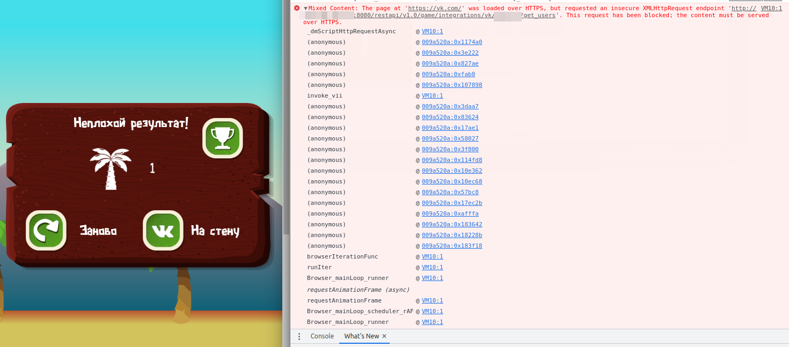
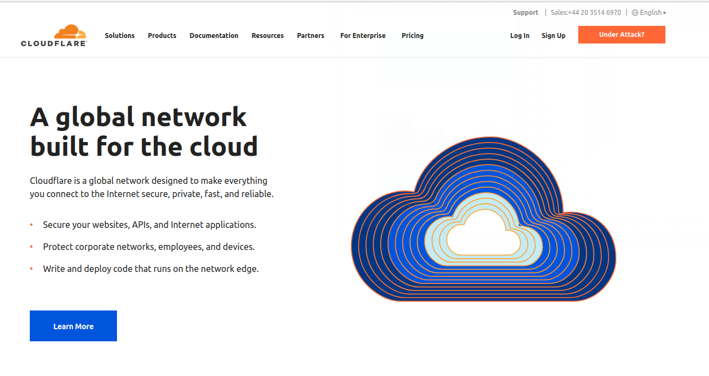
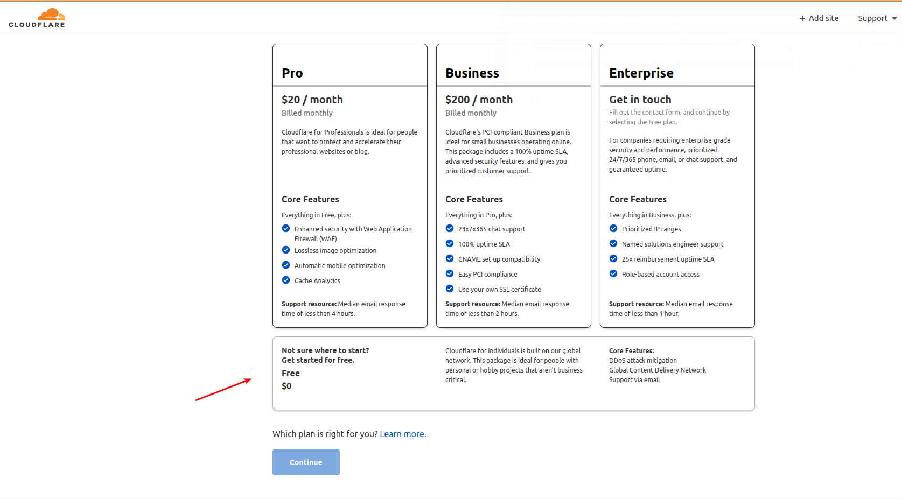

VK + Defold = Money

Это простой пример того, как можно "завести" vk-интеграцию в Defold.
Шаги простые:

1. Создаем свой engine-template.html (копируем из built-ins) и добавляем вниз такую строчку:

<script src="https://unpkg.com/@vkontakte/vk-bridge/dist/browser.min.js"></script>

"Что за шаманизм? Откуда это всё?" - спросите вы.
А я отвечу: "с их официального гита https://github.com/VKCOM/vk-bridge"


2. Прописываем свой engine-templete.html в настройки проекта (называется эта опция .html Shell - странное название, тут я соглашусь)


3. Теперь добавляем очень крутой ассет jstodef. (гит, почитайте, там все хорошо расписано https://github.com/AGulev/jstodef)


4. Теперь либо копируем мой vkModule.lua, либо делаем что-то подобное на его базе. Смысл в том, что нужно уметь делать несколько вещей: инициализацию, рекламу, и несколько вк-шных штук типа "пригласи друга" и "положить на стену".


5. Все готово, можно использовать. Не забудьте только внутри vkModule.lua наверху прописать свое приложение в значении appValue. Оно подтягивается внутрь и тогда все ссылки типа "положить на стену" будут вести на ваше приложение. 


6. А! Ну и текст в VKWebAppShowWallPostBox в lua-модуле тоже можете свой положить. Это уже по желанию.

# Интеграция с VK API
Для начисления очков и некоторых других фич ВК нужно вызывать `REST` методы `VK API`.

Ряд этих API методов, включая начисление очков игроку, не работает без нескольких условий:

* игра должна пройти модерацию
* нужно правильно предоставить аутентификационные данные и параметры для корректного выполнения метода

Также важно выполнить требования безопасности:

* "Защищённый ключ" из настроек приложения **не должен** публиковаться в коде игры
* "Сервисный ключ доступа" из настроек приложения **не должен** публиковаться в коде игры

 

Это подразумевает, что данные функции следует вызывать используя собственный сервер, который используя упомянутые выше ключи, будет вызывать необходимые API методы ВК для конкретного пользователя игры. 

Для этого был реализован простейший игровой сервер с рабочим названием "HTML5 Games Web Service"

# HTML5 Games Web Service
Сервис в данный момент реализует 2 простейшие фичи `VK API`:
- получить инфо по пользователям
- начислить очки/уровни игроку

Сервис реализован в виде Java приложения на фреймворке Spring Boot, для удобства оформлен в виде [docker образа](https://hub.docker.com/r/unclekairat/game-service), опубликованного на https://hub.docker.com.

## Требования для запуска сервиса:
- `виртуалка` в облаке. Подойдёт например, free tier на Oracle Cloud. Инструкция, как завести себе такую машинку есть тут: https://habr.com/ru/post/541466/ . Еще из недорогих и удобных Cloud провайдеров рекомендую - https://www.scaleway.com. Можно получить вменяемую конфигурацию за 2-5 евро/мес в нужном под свои задачи регионе - например, Европа.
- установленный на ОС виртуалки `git`
- установленный на ОС виртуалки `docker`
    Инструкции по установке можно найти здесь: 
    1. Инструкция для CentOS систем: https://docs.docker.com/engine/install/centos/
    2. Инструкция для Debian систем: https://docs.docker.com/engine/install/debian/
    3. Инструкция для Ubuntu: https://docs.docker.com/engine/install/ubuntu/
    > Важно! Рекомендую добавить юзера целевой системы в группу docker, чтобы не вызывать все методы утилиты docker от имени root-юзера. В принципе, если в системе изначально по входу применяется root user - данную рекомендацию можно игнорировать.
    
    Если docker установлен и работает в ОС, то следующая команда должна выполниться успешно:
    
    ```
    $ docker ps
    CONTAINER ID   IMAGE     COMMAND   CREATED   STATUS    PORTS     NAMES
    ```
- установленный на ОС виртуалки `docker-compose`
- "Защищённый ключ" и "Сервисный ключ доступа", взятые из настроек Приложения в ВК
- придуманная уникальная секретная строка для минимальной "poor man's" защиты от спамеров, сетевых сканеров и мамкиных хакеров
Например, `z7Gbe81`
- приобретенный собственный домен, а также `SSL` сертификат для защищенного доступа по https-протоколу к развернутому на виртуалке сервису. Подробнее о настройке доступа по `https` до сервиса смотри секцию "Настраиваем HTTPS доступ до сервиса"
- открытые и доступные извне порты `80`, `443` на целевой виртуалке. 

    Инструкции по открытию порта наружу разнятся от Облачного провайдера и от дистрибутива на виртаулке. Инструкции для Oracle Cloud будут приведены позже.
- `[[[Опционально]]]` Билд вашей игры также может быть залит на виртуалку с `HTML5 Games Web Service`. Таким образом, он будет раздаваться самим сервисом наподобие того, как это делают GitHub Pages. Данный пункт по желанию, в принципе, игру можно продолжать хостить на вашей любимой `CDN` , например, посредством `GitHub Pages`.

## Подготовка и запуск сервиса на виртуалке
1. Зайдите на виртуалку, пример команды для `Oracle Cloud` сервера с ОС `Oracle Linux`:
```
ssh -i my.key opc@xxx.xxx.xxx.xx
```
    где my.key - ssh-ключ, предоставленный провайдером при оформлении виртуалки или заведенный заранее собственный ключ через ssh-keygen, важно, что он предоставляет доступ на ваш сервер. `xxx.xxx.xxx.xx` - публичный IP виртуалки.
1. "Склонируйте" проект [vk-tutor](https://github.com/Lampogolovii/vk-tutor)

    ```
    git clone https://github.com/Lampogolovii/vk-tutor.git
    ```
1. Зайдите в `vk-tutor/game_service/`
1. Отредактируйте конфигурационный файл docker-compose.yml:
    ```
    ...
    environment:
      GAME_INTEGRATIONS_VK_CLIENT_SECRET: "ВАШ_ЗАЩИЩЕННЫЙ_КЛЮЧ_ЗДЕСЬ"
      GAME_INTEGRATIONS_VK_ACCESS_TOKEN: "ВАШ_СЕРВИСНЫЙ_КЛЮЧ_ДОСТУПА_ЗДЕСЬ"
      GAME_INTEGRATIONS_VK_SECRET_PATH: "ВАША_придуманная_уникальная_секретная_строка"
    ...
    ```
    Сохраните файл
1. Запустите сервер командой 

    ```
    ./start.sh
    ```
    
Сервер готов принимать входящие запросы от вашей игры.

Остановить работу сервера можно командой

```
./stop.sh
```

> Важно! Для вызова методов сервиса важно иметь публичный доступ до него по https протоколу с доверенным и валидным SSL-сертификатом. В противном случае, запрос не пройдёт с ошибкой наподобие:
    
Данная ошибка говорит о том, что запрос от приложения, хостящегося по https-протоколу (наша игра) к не защищенному API по http-протоколу был заблокирован браузером. Подробнее о том, как решается эта проблема описано в секции "Настраиваем HTTPS доступ до сервиса"

## Настраиваем HTTPS доступ до сервиса
**TBD**
1. Для начала вам нужен собственный домен, который нужно привязать к публичному IP, по которому отвечает запущенный сервис "HTML5 Games Web Service", короче говоря, публичный IP до нашей виртуалки в облаке.

Я приобретал домен на `reg.ru`, стандартно домен можно купить на год, затем его нужно продлевать, но можно настроить автоматическое продление. Это по вашему усмотрению.

Домены можно купить на большом количестве регистраторов доменных имен - `GoDaddy`, например и т.д.
1. Далее нужно настроить HTTPS доступ с SSL сертификатом, выданным одним из удостоверяющих центров (CA). Одним из таких является, например, Let's Encrypt.

Ниже будут приведены инструкции по настройке HTTPS доступа с автоматически поддерживаемым и обновляемым SSL сертификатом через сервис Cloudflare, с использованием бесплатного тарифа на нём.

### Настраиваем HTTPS доступ до сервиса с помощью Cloudflare
1. Для начала регистриуемся на `Cloudflare`

    

1. Выбираем тариф free

    


> Хорошее видео демонстрирующее описанные выше шаги есть на YouTube и с русской озвучкой - https://www.youtube.com/watch?v=R541VXHVaiM

## Пример начисления очков
В коде игры в нужный момент (например, Game Over на уровне), нужно вызвать метод из Lua модуля `vkModule.lua`

```
    local user_id = 295926976 -- user_id id пользователя ВКонтакте, запустившего вашу игру. Можно получить из вызова метода GetUserInfo из `vkModule.lua` на старте игры 
    local activity_id = 2 -- 1 — достигнут новый уровень, работает аналогично secure.setUserLevel; 2 — заработано новое число очков;
    -- !!! Каждую миссию можно сохранить только один раз, при повторном вызове вернется ошибка. 
    local score = 7
    self.vk.VkIntegrationApiSetScore('https://my.awesome.games.net', 443, 'z7Gbe81', user_id, score, activity_id, function(self, id, response) 
        -- Можно вызвать здесь свою логику по завершении метода
        -- Успешно выполненный метод вернёт в этот колбек response.status = 200 и response.response = '{"response":7}' , где 7 - число начисленных очков
        print(response.status, response.response)
    end)
```

Пример ответа-"ошибки" от `VK API`, когда пытаемся начислить количество очков, которое меньше уже начисленных ранее (`VK API` запоминает и хранит максимально начисленное ранее количество очков):

```
{"error":{"error_code":100,"error_msg":"One of the parameters specified was missing or invalid: score is less or equals to current one","request_params":[{"key":"method","value":"secure.addAppEvent"},{"key":"oauth","value":"1"},{"key":"v","value":"5.124"},{"key":"client_secret","value":"..."},{"key":"activity_id","value":"2"},{"key":"user_id","value":"..."},{"key":"value","value":"1"}]}}
```

По идее, можно игнорировать подобную ошибку в своей игре, а можно заморочиться и храня в своей игре последнее максимальное значение (по сути, "кеш" браузера), посылать запросы только, если превысили последнее запомненное на клиенте значение очков игрока.
 
 
