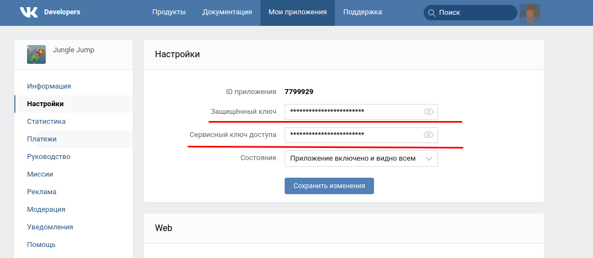

VK + Defold = Money

Это простой пример того, как можно "завести" vk-интеграцию в Defold.
Шаги простые:

1. Создаем свой engine-template.html (копируем из built-ins) и добавляем вниз такую строчку:

<script src="https://unpkg.com/@vkontakte/vk-bridge/dist/browser.min.js"></script>

"Что за шаманизм? Откуда это всё?" - спросите вы.
А я отвечу: "с их официального гита https://github.com/VKCOM/vk-bridge"


2. Прописываем свой engine-templete.html в настройки проекта (называется эта опция .html Shell - странное название, тут я соглашусь)


3. Теперь добавляем очень крутой ассет jstodef. (гит, почитайте, там все хорошо расписано https://github.com/AGulev/jstodef)


4. Теперь либо копируем мой vkModule.lua, либо делаем что-то подобное на его базе. Смысл в том, что нужно уметь делать несколько вещей: инициализацию, рекламу, и несколько вк-шных штук типа "пригласи друга" и "положить на стену".


5. Все готово, можно использовать. Не забудьте только внутри vkModule.lua наверху прописать свое приложение в значении appValue. Оно подтягивается внутрь и тогда все ссылки типа "положить на стену" будут вести на ваше приложение. 


6. А! Ну и текст в VKWebAppShowWallPostBox в lua-модуле тоже можете свой положить. Это уже по желанию.

# Интеграция с API VK
Для начисления очков и некоторых других фич ВК нужно вызывать REST методы API VK.

Ряд этих API методов, включая начисление очков игроку, не работает без нескольких условий:

* игра должна пройти модерацию
* нужно правильно предоставить аутентификационные данные и параметры для корректного выполнения метода

Также важно выполнить требования безопасности:

* "Защищённый ключ" из настроек приложения **не должен** публиковаться в коде игры
* "Сервисный ключ доступа" из настроек приложения **не должен** публиковаться в коде игры

 

Это подразумевает, что данные функции следует вызывать используя собственный сервер, который используя упомянутые выше ключи, будет вызывать необходимые API методы ВК для конкретного пользователя игры. 

Для этого был реализован простейший игровой сервер с рабочим названием "HTML5 Games Web Service"

# HTML5 Games Web Service
Сервис в данный момент реализует 2 простейшие фичи API VK:
- получить инфо по пользователям
- начислить очки/уровни игроку

Сервис реализован в виде Java приложения на фреймворке Spring Boot, для удобства оформлен в виде docker образа, опубликованного на https://hub.docker.com.

## Требования для запуска сервиса:
- `виртуалка` в облаке. Подойдёт например, free tier на Oracle Cloud. Инструкция, как завести себе такую машинку есть тут: https://habr.com/ru/post/541466/ . Еще из недорогих и удобных Cloud провайдеров рекомендую - https://www.scaleway.com. Можно получить вменяемую конфигурацию за 2-5 евро/мес в нужном под свои задачи регионе - например, Европа.
- установленный на ОС виртуалки `git`
- установленный на ОС виртуалки `docker`
    Инструкции по установке можно найти здесь: 
    1. Инструкция для CentOS систем: https://docs.docker.com/engine/install/centos/
    2. Инструкция для Debian систем: https://docs.docker.com/engine/install/debian/
    3. Инструкция для Ubuntu: https://docs.docker.com/engine/install/ubuntu/
    > Важно! Рекомендую добавить юзера целевой системы в группу docker, чтобы не вызывать все методы утилиты docker от имени root-юзера. В принципе, если в системе изначально по входу применяется root user - данную рекомендацию можно игнорировать.
    
    Если docker установлен и работает в ОС, то следующая команда должна выполниться успешно:
    
    ```
    $ docker ps
    CONTAINER ID   IMAGE     COMMAND   CREATED   STATUS    PORTS     NAMES
    ```
- установленный на ОС виртуалки `docker-compose`
- "Защищённый ключ" и "Сервисный ключ доступа", взятые из настроек Приложения в ВК
- придуманная уникальная секретная строка для минимальной "poor man's" защиты от спамеров, сетевых сканеров и мамкиных хакеров
Например, `z7Gbe81`
- открытый и доступный извне порт `8080` на целевой виртуалке. Инструкции по открытию порта наружу разнятся от Облачного провайдера и от дистрибутива на виртаулке. Инструкции для Oracle Cloud будут приведены позже.

## Подготовка и запуск сервиса на виртуалке
1. Зайдите на виртуалку, пример команды для Oracle Cloud сервера:
```
ssh -i my.key opc@xxx.xxx.xxx.xx
```
    где my.key - ssh-ключ, предоставленный провайдером при оформлении виртуалки или заведенный заранее собственный ключ через ssh-keygen, важно, что он предоставляет доступ на ваш сервер. `xxx.xxx.xxx.xx` - публичный IP виртуалки.
1. "Склонируйте" проект [vk-tutor](https://github.com/Lampogolovii/vk-tutor)

    ```
    git clone https://github.com/Lampogolovii/vk-tutor.git
    ```
1. Зайдите в `vk-tutor/game_service/`
1. Отредактируйте конфигурационный файл docker-compose.yml:
    ```
    ...
    environment:
      GAME_INTEGRATIONS_VK_CLIENT_SECRET: "ВАШ_ЗАЩИЩЕННЫЙ_КЛЮЧ_ЗДЕСЬ"
      GAME_INTEGRATIONS_VK_ACCESS_TOKEN: "ВАШ_СЕРВИСНЫЙ_КЛЮЧ_ДОСТУПА_ЗДЕСЬ"
      GAME_INTEGRATIONS_VK_SECRET_PATH: "ВАША_придуманная_уникальная_секретная_строка"
    ...
    ```
    Сохраните файл
1. Запустите сервер командой 

    ```
    ./start.sh
    ```
    
Сервер готов принимать входящие запросы от вашей игры.

Остановить работу сервера можно командой

```
./stop.sh
```

> Важно! Для вызова методов сервиса важно знать его адрес. Самый удобный способ - завести (купить) домен и закрепить его за актуальным рабочим публичным IP сервиса. Чтобы например, в коде игры посылать запросы не на IP xxx.xxx.xxx.xx:8080, который может измениться в любой момент (пересоздание машины, переезд на другого провайдера, прокси настройки и т.д.), а на постоянный домен, например my.awesome.games.net:8080 , который всегда будет вести на актуальный рабочий IP адрес сервиса (актуальность привязки домена к IP адресу вам нужно будет поддерживать и проверять самому)

> Важно! (2) Часто облачные провайдеры предоставляют еще доменное имя в дополнение к IP вашей виртуалки. В принципе, как вариант, какое-то время можно использовать его, но по сути, это то же самое, что использовать IP, лучше всё таки иметь какой-то свой постоянный узнаваемый домен в регистраторе доменных имен.

## Пример начисления очков
В коде игры в нужный момент (например, Game Over на уровне), нужно вызвать метод из Lua модуля `vkModule.lua`

```
    local user_id = 295926976 -- user_id id пользователя ВКонтакте, запустившего вашу игру. Можно получить из вызова метода GetUserInfo из `vkModule.lua` на старте игры 
    local activity_id = 2 -- 1 — достигнут новый уровень, работает аналогично secure.setUserLevel; 2 — заработано новое число очков;
    -- !!! Каждую миссию можно сохранить только один раз, при повторном вызове вернется ошибка. 
    local score = 7
    self.vk.VkIntegrationApiSetScore('http://my.awesome.games.net', 8080, user_id, 'z7Gbe81', 7170524, score, activity_id,function(self, id, response) 
        -- Можно вызвать здесь свою логику по завершении метода
        -- Успешно выполненный метод вернёт в этот колбек response.status = 200 и response.response = '{"response":7}' , где 7 - число начисленных очков
        print(response.status, response.response)
    end)
```

 
 
